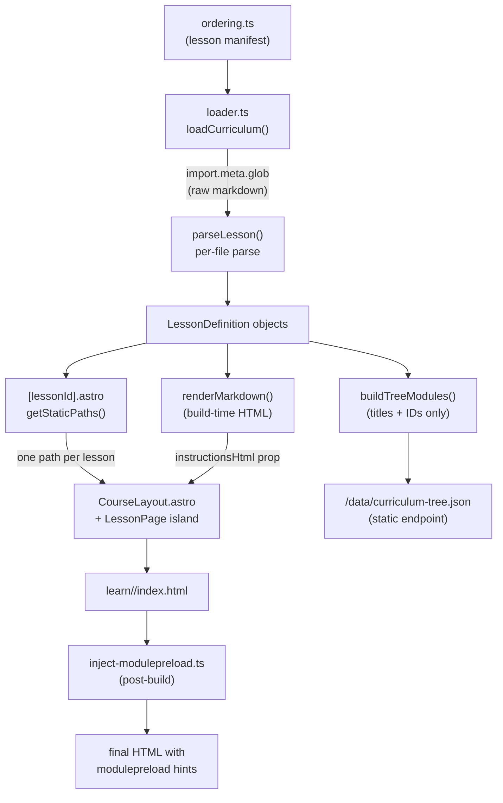
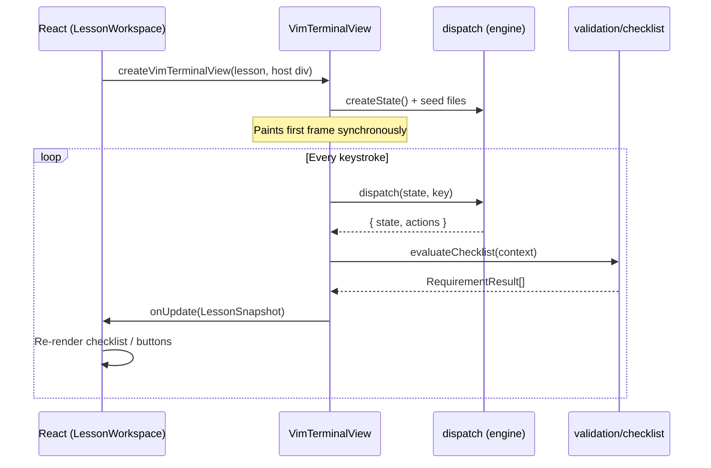

# Architecture overview

The codebase has four distinct layers. They are ordered so each depends only on the one below it, and the boundary between them is strict enough to be testable in isolation.

```
┌─────────────────────────────────────────────────┐
│  Astro pages / layouts                          │  SSG shell; zero logic
├─────────────────────────────────────────────────┤
│  React islands  (LessonWorkspace, Home)         │  UI + lifecycle
├─────────────────────────────────────────────────┤
│  Terminal bridge  (vimTerminalView)             │  Owns progress state; paints the DOM grid
├─────────────────────────────────────────────────┤
│  Vim engine  (engine/, validation/)             │  Pure reducer; no DOM, no React
└─────────────────────────────────────────────────┘
          ↑ fed by ↑
┌─────────────────────────────────────────────────┐
│  Curriculum  (curriculum/)                      │  Lesson parsing; runs at build time
└─────────────────────────────────────────────────┘
```

---

## Build pipeline

How a lesson `.md` file becomes a static HTML page:



`ordering.ts` is the source of truth for which lessons exist and in what order. `loader.ts` ingests the raw markdown at build time via `import.meta.glob`, parses the YAML frontmatter and `# --section--` blocks, expands `@group` command aliases, validates every field loudly, and returns typed `LessonDefinition` objects. The `.astro` page calls `getStaticPaths()` to emit one HTML file per lesson. The full lesson definition, including all file seeds and the checklist, is serialized as a hydration prop.

Lesson instructions are pre-rendered to HTML at build time by `renderMarkdown()` (`src/components/base/Markdown/renderMarkdown.ts`) in the `.astro` frontmatter. The `Markdown` component receives the pre-rendered `html` string and renders it with `dangerouslySetInnerHTML`, so `marked` (the markdown parser) is excluded from the client bundle entirely.

A static JSON endpoint (`src/pages/data/curriculum-tree.json.ts`) outputs the curriculum tree (module titles, slugs, and lesson title/ID pairs) plus the ordered lesson ID list. This is a single ~6KB file fetched once by the client and cached for the lifetime of the JS bundle. A `<link rel="preload">` in the layout head starts the fetch in parallel with JS loading.

A post-build script (`scripts/inject-modulepreload.ts`) traces the JS import graph from each page's `<astro-island>` and `<script type="module">` elements and injects `<link rel="modulepreload">` hints into every HTML file, eliminating the sequential JS dependency waterfall.

---

## Runtime flow

After the browser loads the page:



React owns only the shell (instructions, checklist display, nav buttons). The engine state lives entirely inside `VimTerminalView` as a closure variable. React receives a `LessonSnapshot` after each keystroke: `{ checklist, complete, dirty, resettable }`. There is no engine state in React state.

---

## Key directories

| Path                       | What lives there                                                                                                                                                 |
| -------------------------- | ---------------------------------------------------------------------------------------------------------------------------------------------------------------- |
| `src/engine/`              | The Vim simulator. Pure functions only. No DOM, no React. `dispatch.ts` is the main reducer; `commands/` holds one file per command family.                      |
| `src/terminal/`            | The DOM rendering layer. `terminalView.ts` paints a grid of `<span>` elements. `vimTerminalView.ts` bridges the engine to the grid and owns `LessonProgress`.    |
| `src/curriculum/`          | Lesson parsing (`loader.ts`), domain types (`types.ts`), lesson engine adapter (`lessonEngine.ts`), progress state machine (`lessonProgress.ts`), `buildTreeModules.ts` (server-side helper that converts `LessonDefinition[]` to the lightweight `CurriculumTreeModule[]` for the static JSON endpoint), `useCurriculumTree.ts` (client-side hook for the cached JSON), and utilities. |
| `src/validation/`          | `checklist.ts` evaluates `LessonTest` predicates against a `ChecklistContext`. Separate from the engine so it can be tested without engine state.                |
| `src/components/base/`     | UI atoms with no domain knowledge: Button, Modal, Switch, TabGroup, Icon, Markdown.                                                                              |
| `src/components/features/` | Domain-aware components: VimTerminal, Checklist, NavDrawer, SettingsModal, etc.                                                                                  |
| `src/views/`               | Page-level islands: `LessonPage.tsx` (wraps `LessonWorkspace.tsx`) and `Home.tsx`.                                                                               |
| `src/stores/`              | `courseChrome.ts`: a small pub/sub store for overlay open/close state shared across islands.                                                                     |
| `src/hooks/`               | React hooks for lesson state, progress persistence, theme, keyboard shortcuts, and platform detection.                                                           |

---

## React islands and hydration

Three islands share one lesson page. React Context cannot cross island boundaries (each is a separate React root), so they communicate via `courseChrome`, a module-level pub/sub store that works with `useSyncExternalStore`.

| Island            | Directive             | Role                                     |
| ----------------- | --------------------- | ---------------------------------------- |
| `HeaderControls`  | `client:only="react"` | Drawer / shortcuts / settings buttons    |
| `CourseOverlays`  | `client:only="react"` | NavDrawer, ShortcutsModal, SettingsModal |
| `LessonPage`      | `client:only="react"` | Instructions, terminal, checklist, nav   |

All islands use `client:only="react"`, which skips server pre-rendering and renders entirely in the browser. The home page has a single `Home` island (also `client:only`).

### Curriculum data loading

`NavDrawer` and `Home` need module titles, lesson IDs, and course order to render their navigation trees, progress bar, and continue button. This data must not be imported client-side: `loader.ts` uses `import.meta.glob` with `{ eager: true }`, which would bundle every lesson markdown file into the client JS.

A static JSON endpoint (`src/pages/data/curriculum-tree.json.ts`) generates the data at build time from `loadCurriculum()` + `buildTreeModules()`. The client fetches it once via `useCurriculumTree()` (`src/curriculum/useCurriculumTree.ts`), a hook backed by a module-level eager fetch and in-memory cache. A `<link rel="preload">` hint in `CourseLayout.astro`'s `<head>` starts the fetch in parallel with JS loading, so the data is typically in the browser's HTTP cache before the islands mount.

With the Client Router keeping JS alive across navigations, the cached data is available synchronously on every page after the first load. Components that depend on the data degrade gracefully while the fetch is in flight: `CourseOverlays` (nav drawer starts closed), `Home` (conditionally renders progress and tree), and `LessonWorkspace` (keyboard shortcuts fall back to an empty list).

The lesson page's critical-path navigation (the Next button) does not depend on the JSON fetch. The `.astro` frontmatter precomputes scalar `nextLessonId` and `isLastLesson` props so the advance action works immediately.

---

## Navigation and page loading

The site is an MPA (multi-page app) built with Astro's static site generation. Every lesson produces its own `learn/<id>/index.html`. Astro's Client Router (`astro:transitions`) is enabled in `CourseLayout.astro`, giving SPA-style navigation: clicking a lesson link or calling `navigate()` fetches the next page's HTML in the background and swaps the DOM without a full page reload. JS modules stay alive across navigations, so the curriculum tree JSON and all React code are loaded once.

Lesson-to-lesson advance and keyboard shortcuts (`Alt+N`/`Alt+P`) use `navigate()` from `astro:transitions/client` instead of `window.location.href`. The `markComplete()` call persists progress to `localStorage` synchronously before the navigation dispatches.

Three performance measures reduce first-load latency:

1. **Modulepreload hints** — a post-build script injects `<link rel="modulepreload">` for every JS module the page needs, eliminating the sequential import waterfall.
2. **Build-time markdown rendering** — lesson instructions are parsed to HTML in `.astro` frontmatter by `renderMarkdown()`, so `marked` (~42KB) is excluded from the client bundle.
3. **Static JSON for curriculum data** — module titles and lesson IDs are served as a single cached JSON file instead of being duplicated in every page's HTML.

---

## Engine state

`EditorState` is a plain object updated with spread operators. Key fields:

- `buffer: string[]` — lines of the active file
- `mode` — `normal | insert | visual | visual-line | command-line | explorer | shell | animation`
- `cursor`, `desiredCol`, `pendingOperator`, `pendingCount`
- `files: Map<string, VirtualFile>` — the virtual filesystem
- `history: Action[]` — append-only log of every executed action; the checklist reads this
- `undoStack`, `redoStack`, `register`

`dispatch(state, key)` is a pure reducer. It routes by mode, applies the command, then runs `applyFilter()` to check `allowedCommands`. The result carries `{ state, actions }`. An `actionCursors` WeakMap records the cursor position at the moment each `Action` was produced, so checklist predicates can check `atCursor` without adding fields to `Action`.

---

## Lesson file format

Each lesson is a `.md` file with this structure:

```
---
id: <hex string>
type: intro | learn | practice | review
title: '...'
---

# --instructions--
Prose markdown.

# --files--
## filename.txt
```

file contents, may contain ${decoration} markers

````

# --config--
```json
{
  "start": "file" | "explore" | "shell" | "splash" | "animation",
  "cursor": [row, col],
  "allowedCommands": ["h", "j", "@navigation"],
  "checklist": [
    { "label": "...", "test": { ... } }
  ]
}
````

# --expected-- (optional; content for equalsExpected tests)

## filename.txt

```
expected file contents
```

`loader.ts` strips comments and trailing commas from the JSON config, then validates every field at build time. A malformed lesson fails the build.

---

## Testing

82 test files, co-located next to their source (e.g. `dispatch.test.ts` next to `dispatch.ts`).

- **Engine tests** (`engine/**/*.test.ts`) are pure unit tests. They call `dispatch()` directly and assert on the returned state and action array.
- **Curriculum tests** (`curriculum/loader.test.ts`, `curriculumIntegrity.test.ts`) load the real lesson files and check structural invariants across all lessons. `curriculumIntegrity.test.ts` acts as a lint pass over all authored content.
- **Validation tests** (`validation/checklist.test.ts`) test `evaluateChecklist` against synthetic `ChecklistContext` objects.
- **Terminal tests** (`terminal/*.test.ts`) test the DOM grid renderer in jsdom. `VimTerminal.test.tsx` mocks `createVimTerminalView` to avoid DOM painting.
- **Component tests** (`components/**/*.test.tsx`, `views/*.test.tsx`) use React Testing Library; interactions go through `userEvent`.
- **Hook tests** (`hooks/*.test.ts`) test hooks in isolation via RTL's `renderHook`.

Progress persistence (`useProgress`) reads and writes `localStorage` under `vim-course:progress` as `{ version: 1, completed: string[] }`.
