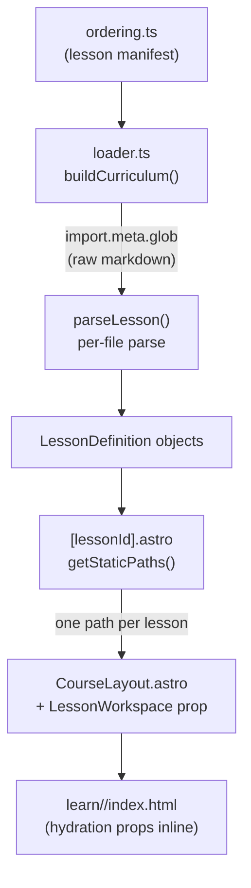
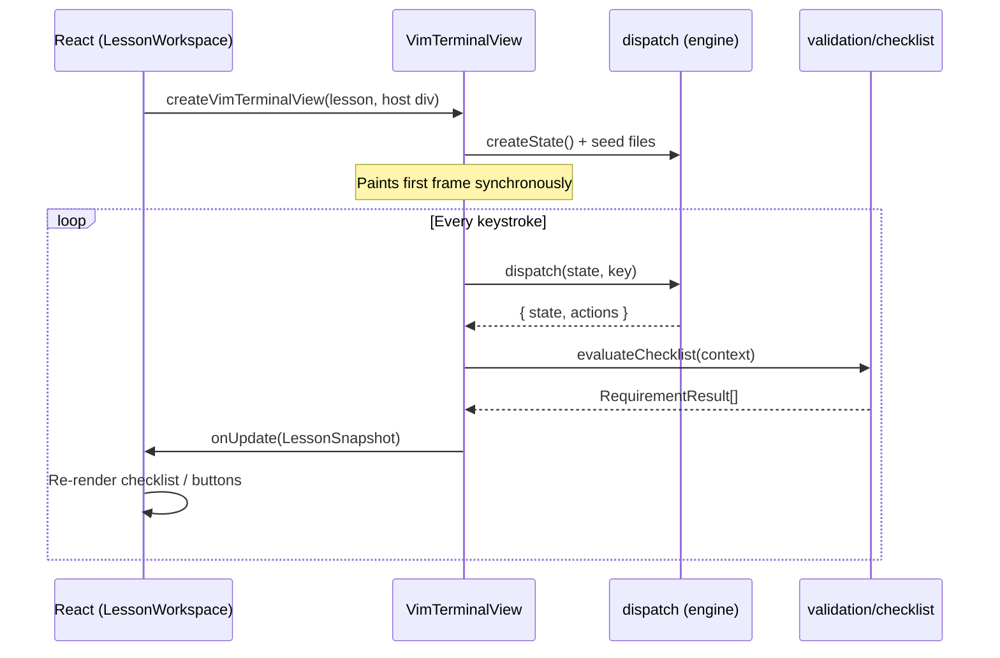

# Architecture overview

The codebase has four distinct layers. They are ordered so each depends only on the one below it, and the boundary between them is strict enough to be testable in isolation.

```
┌─────────────────────────────────────────────────┐
│  Astro pages / layouts                          │  SSG shell; zero logic
├─────────────────────────────────────────────────┤
│  React islands  (LessonWorkspace, Home)         │  UI + lifecycle
├─────────────────────────────────────────────────┤
│  Terminal bridge  (vimTerminalView)             │  Owns progress state; paints the DOM grid
├─────────────────────────────────────────────────┤
│  Vim engine  (engine/, validation/)             │  Pure reducer; no DOM, no React
└─────────────────────────────────────────────────┘
          ↑ fed by ↑
┌─────────────────────────────────────────────────┐
│  Curriculum  (curriculum/)                      │  Lesson parsing; runs at build time
└─────────────────────────────────────────────────┘
```

---

## Build pipeline

How a lesson `.md` file becomes a static HTML page:



`ordering.ts` is the source of truth for which lessons exist and in what order. `loader.ts` ingests the raw markdown at build time via `import.meta.glob`, parses the YAML frontmatter and `# --section--` blocks, expands `@group` command aliases, validates every field loudly, and returns typed `LessonDefinition` objects. The `.astro` page calls `getStaticPaths()` to emit one HTML file per lesson. The full lesson definition, including all file seeds and the checklist, is serialized as a hydration prop.

---

## Runtime flow

After the browser loads the page:



React owns only the shell (instructions, checklist display, nav buttons). The engine state lives entirely inside `VimTerminalView` as a closure variable. React receives a `LessonSnapshot` after each keystroke: `{ checklist, complete, dirty, resettable }`. There is no engine state in React state.

---

## Key directories

| Path                       | What lives there                                                                                                                                                 |
| -------------------------- | ---------------------------------------------------------------------------------------------------------------------------------------------------------------- |
| `src/engine/`              | The Vim simulator. Pure functions only. No DOM, no React. `dispatch.ts` is the main reducer; `commands/` holds one file per command family.                      |
| `src/terminal/`            | The DOM rendering layer. `terminalView.ts` paints a grid of `<span>` elements. `vimTerminalView.ts` bridges the engine to the grid and owns `LessonProgress`.    |
| `src/curriculum/`          | Lesson parsing (`loader.ts`), domain types (`types.ts`), lesson engine adapter (`lessonEngine.ts`), progress state machine (`lessonProgress.ts`), and utilities. |
| `src/validation/`          | `checklist.ts` evaluates `LessonTest` predicates against a `ChecklistContext`. Separate from the engine so it can be tested without engine state.                |
| `src/components/base/`     | UI atoms with no domain knowledge: Button, Modal, Switch, TabGroup, Icon, Markdown.                                                                              |
| `src/components/features/` | Domain-aware components: VimTerminal, Checklist, NavDrawer, SettingsModal, etc.                                                                                  |
| `src/views/`               | Page-level islands: `LessonWorkspace.tsx` and `Home.tsx`.                                                                                                        |
| `src/stores/`              | `courseChrome.ts`: a small pub/sub store for overlay open/close state shared across islands.                                                                     |
| `src/hooks/`               | React hooks for lesson state, progress persistence, theme, keyboard shortcuts, and platform detection.                                                           |

---

## React islands and hydration

Three islands share one lesson page. React Context cannot cross island boundaries (each is a separate React root), so they communicate via `courseChrome`, a module-level pub/sub store that works with `useSyncExternalStore`.

| Island            | Directive             | Role                                     |
| ----------------- | --------------------- | ---------------------------------------- |
| `HeaderControls`  | `client:only="react"` | Drawer / shortcuts / settings buttons    |
| `CourseOverlays`  | `client:only="react"` | NavDrawer, ShortcutsModal, SettingsModal |
| `LessonWorkspace` | `client:load`         | Instructions, terminal, checklist, nav   |

`client:only` skips pre-rendering (the component renders entirely in the browser). `client:load` pre-renders to static HTML at build time and hydrates immediately; the lesson workspace has no `localStorage` dependency at render time so it can be pre-rendered safely.

---

## Engine state

`EditorState` is a plain object updated with spread operators. Key fields:

- `buffer: string[]` — lines of the active file
- `mode` — `normal | insert | visual | visual-line | command-line | explorer | shell | animation`
- `cursor`, `desiredCol`, `pendingOperator`, `pendingCount`
- `files: Map<string, VirtualFile>` — the virtual filesystem
- `history: Action[]` — append-only log of every executed action; the checklist reads this
- `undoStack`, `redoStack`, `register`

`dispatch(state, key)` is a pure reducer. It routes by mode, applies the command, then runs `applyFilter()` to check `allowedCommands`. The result carries `{ state, actions }`. An `actionCursors` WeakMap records the cursor position at the moment each `Action` was produced, so checklist predicates can check `atCursor` without adding fields to `Action`.

---

## Lesson file format

Each lesson is a `.md` file with this structure:

```
---
id: <hex string>
type: intro | learn | practice | review
title: '...'
---

# --instructions--
Prose markdown.

# --files--
## filename.txt
```

file contents, may contain ${decoration} markers

````

# --config--
```json
{
  "start": "file" | "explore" | "shell" | "splash" | "animation",
  "cursor": [row, col],
  "allowedCommands": ["h", "j", "@navigation"],
  "checklist": [
    { "label": "...", "test": { ... } }
  ]
}
````

# --expected-- (optional; content for equalsExpected tests)

## filename.txt

```
expected file contents
```

`loader.ts` strips comments and trailing commas from the JSON config, then validates every field at build time. A malformed lesson fails the build.

---

## Testing

71 test files, co-located next to their source (e.g. `dispatch.test.ts` next to `dispatch.ts`).

- **Engine tests** (`engine/**/*.test.ts`) are pure unit tests. They call `dispatch()` directly and assert on the returned state and action array.
- **Curriculum tests** (`curriculum/loader.test.ts`, `curriculumIntegrity.test.ts`) load the real lesson files and check structural invariants across all lessons. `curriculumIntegrity.test.ts` acts as a lint pass over all authored content.
- **Validation tests** (`validation/checklist.test.ts`) test `evaluateChecklist` against synthetic `ChecklistContext` objects.
- **Terminal tests** (`terminal/*.test.ts`) test the DOM grid renderer in jsdom. `VimTerminal.test.tsx` mocks `createVimTerminalView` to avoid DOM painting.
- **Component tests** (`components/**/*.test.tsx`, `views/*.test.tsx`) use React Testing Library; interactions go through `userEvent`.
- **Hook tests** (`hooks/*.test.ts`) test hooks in isolation via RTL's `renderHook`.

Progress persistence (`useProgress`) reads and writes `localStorage` under `vim-course:progress` as `{ version: 1, completed: string[] }`.
